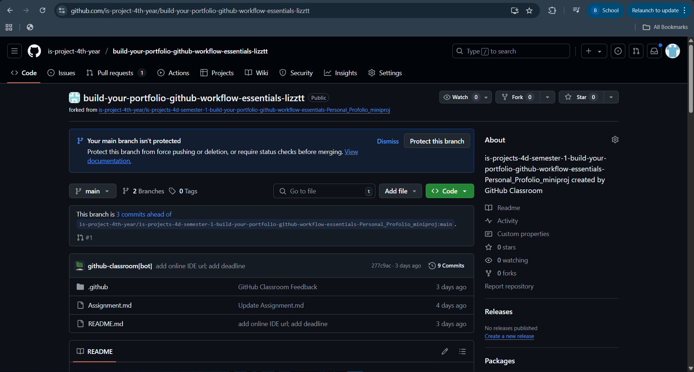
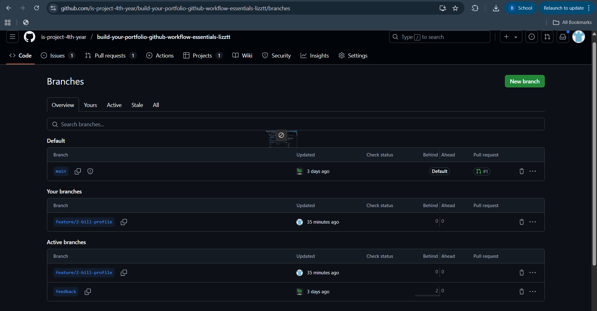
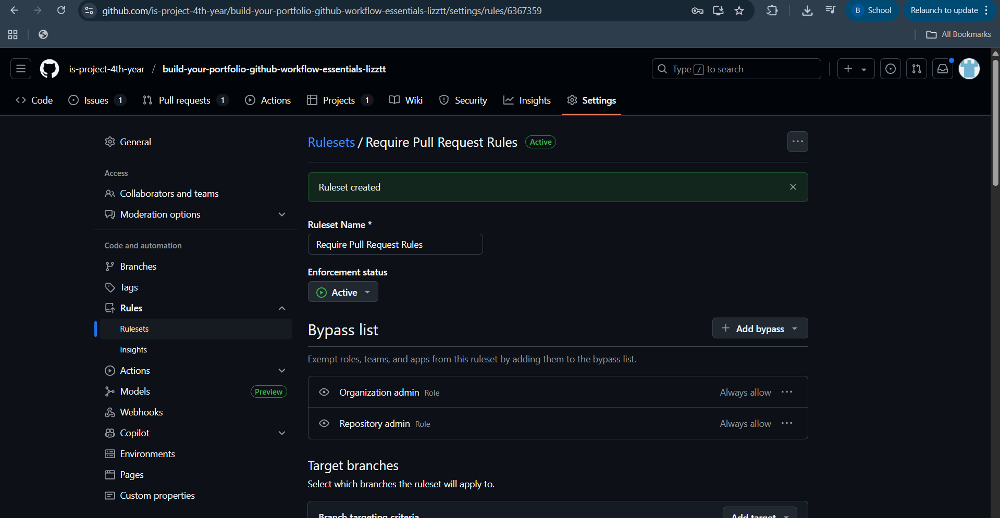
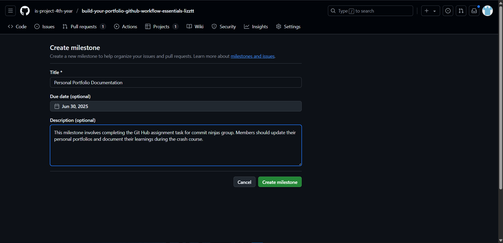
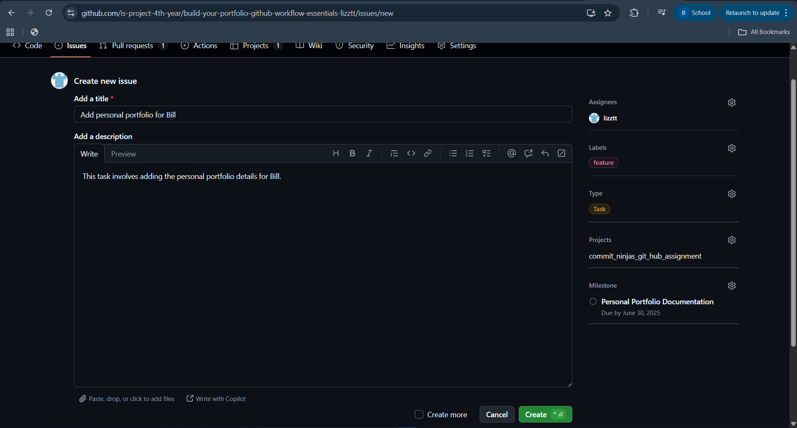

# Personal Portfolio Documentation

## 1. Student Details

Chakairu, Bill Gichuru
151339
Lizztt
bill.chakairu@strathmore.edu
## 2. Deployed Portfolio Link

- **GitHub Pages URL**:  
  _(Provide the live link to your deployed portfolio website)_

## 3. Learnings from the Git Crash Program

**1. Concept: Naming Conventions**
Expectation: I expected a Git & GitHub refresher course. To help me understand how to collaborate in teams and track project history professionally.

Reality: I learnt a lot of conventional practices including how to name commits, branches, issues, and pull requests eg. using names such as feature/2-bill for branches and key words such as feat, fix and docs in commits.

Impact: I created a branch named feeature/2-bill-profile to work on issue 2 which involved adding a personal portfolio section for Bill.

**2. Concept - Branch Security**
Expectation: I assumed security in GitHub was mostly about keeping your username and password safe. 

Reality: I was surprised to learn that GitHub allows deeper project-level access controls. Admins can enforce rules such as restricting who can delete branches, requiring pull request reviews before merging, and even blocking direct pushes to the main branch.

Impact: I implemented branch protection rules on the main branch. This included requiring at least one approved review before a merge and preventing accidental deletions.

**3. Concept -  Pull Requests**
Expectation: I thought collaboration in GitHub was about pushing and pulling directly from the main branch after working on feature branches.

Reality: I learnt that better collaboration is done through pull requests. These allow teammates to review, comment and approve changes before merging the code to the main branch.

Impact: I created a number of pull requests for my tasks.

**4. Concept: Deploying project through GitHub**
Expectation: I normally deploy website on other hosting services.

Reality: I learnt that you could deploy your website through GitHub Pages.

Impact: I deployed the group's portfolio website using GitHub Pages. It was fast and easy to deploy.

### A. Milestones and Issues

### B. Project Board

- Screenshot of your GitHub Project Board with issues organized into columns (e.g., To Do, In Progress, Done).

### C. Branching

- Screenshot showing your branch list with meaningful naming.

### D. Pull Requests

- Screenshot of a pull request that’s either open or merged and linked to a related issue.

### E. Merge Conflict Resolution

- Screenshot of a resolved merge conflict (in a pull request, commit history, or your local terminal/GitHub Desktop).
